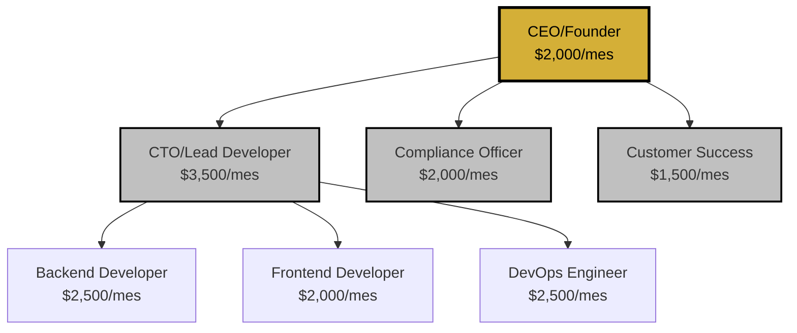
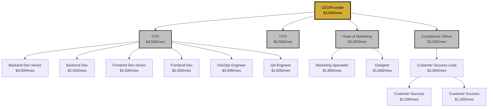
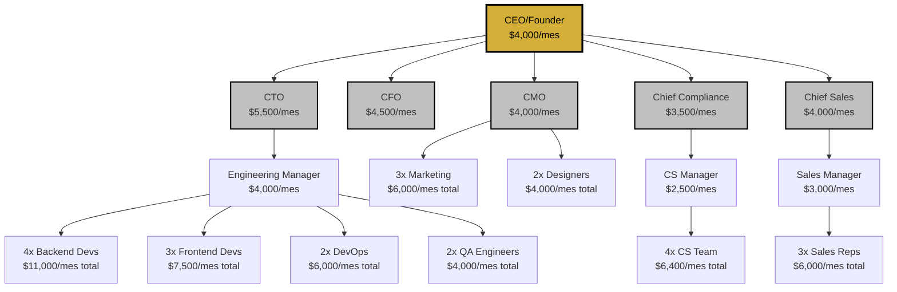
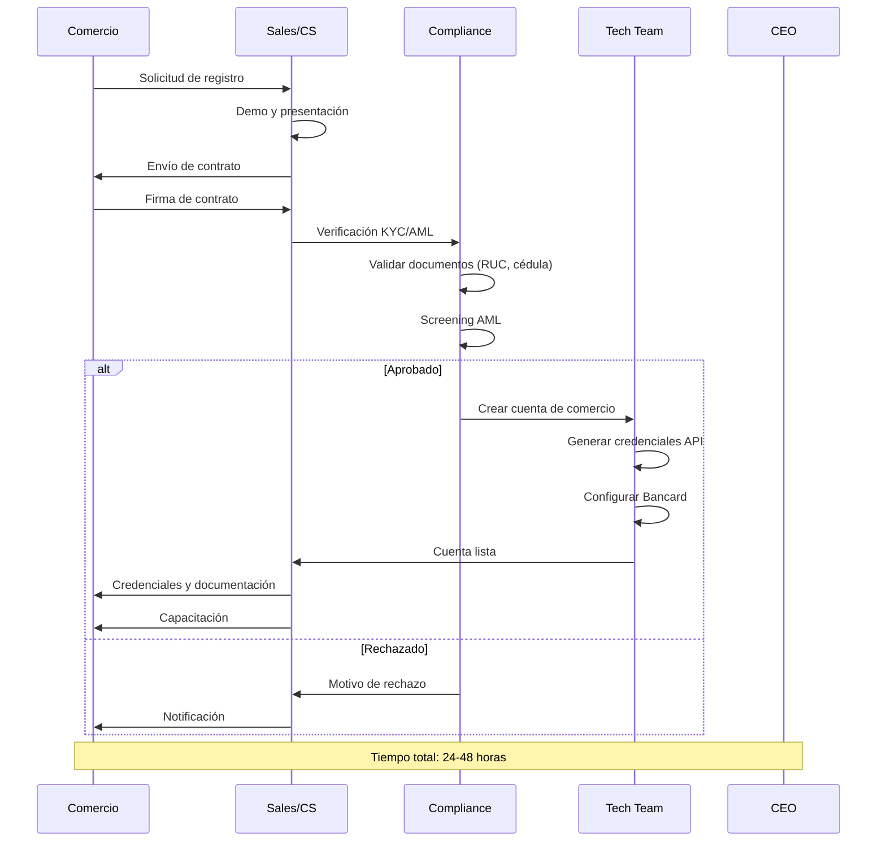
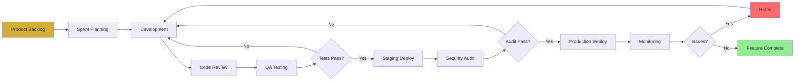
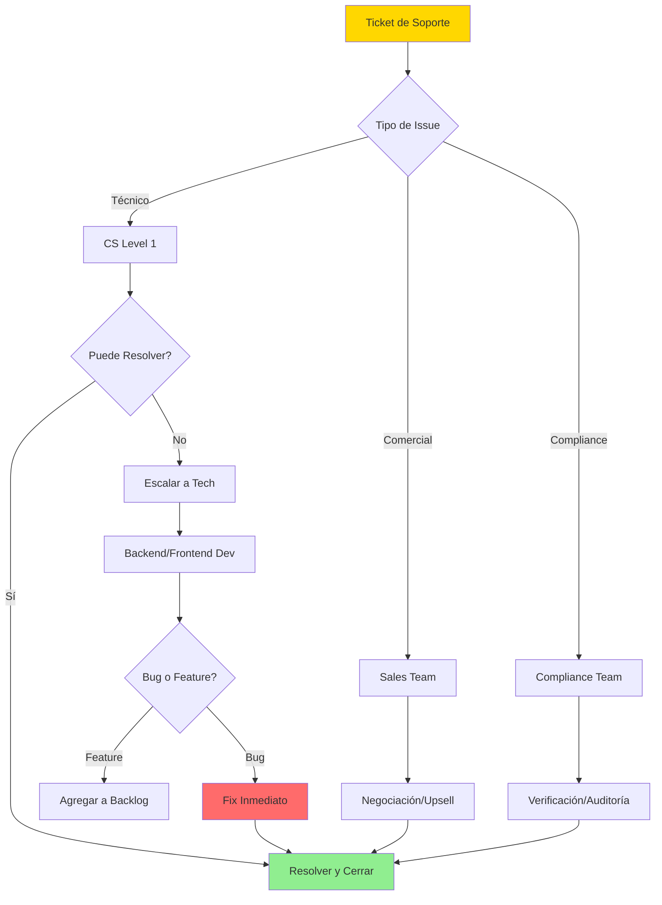
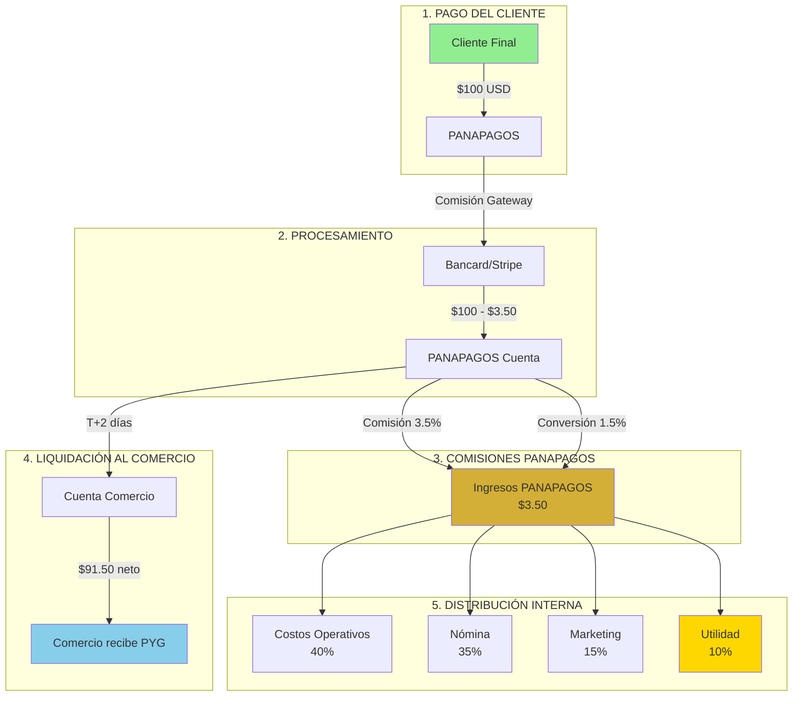
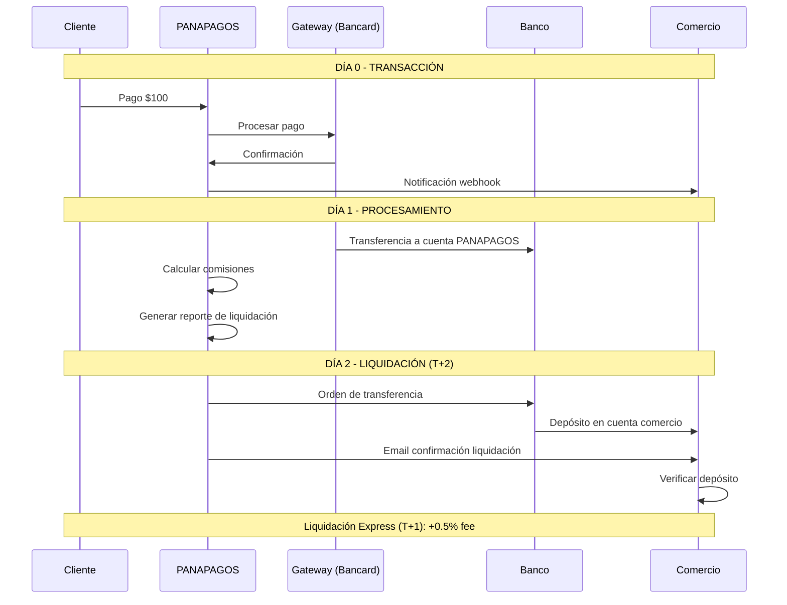
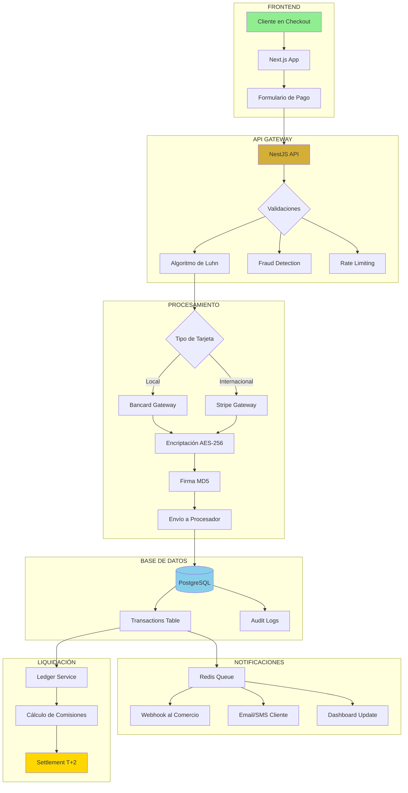
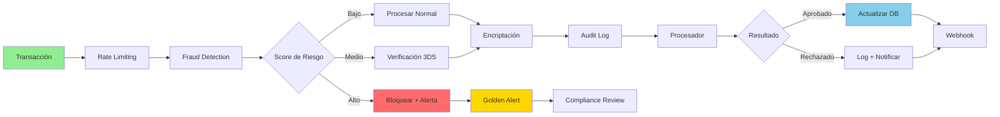

# 👥 ESTRUCTURA ORGANIZACIONAL Y FLUJOS - PANAPAGOS

## 📋 TABLA DE CONTENIDOS
1. [Organigrama por Año](#organigrama-por-año)
2. [Descripción de Roles](#descripción-de-roles)
3. [Flujo de Trabajo Operativo](#flujo-de-trabajo-operativo)
4. [Flujo de Dinero](#flujo-de-dinero)
5. [Flujo de Transacciones](#flujo-de-transacciones)
6. [Costos de Nómina](#costos-de-nómina)

---

## 📊 ORGANIGRAMA POR AÑO

### AÑO 1 - EQUIPO FUNDADOR (7 personas)



**Total Año 1: 7 personas | $16,000/mes | $192,000/año + 30% cargas = $249,600/año**

---

### AÑO 2 - CRECIMIENTO (15 personas)



**Total Año 2: 15 personas | $36,600/mes | $439,200/año + 30% cargas = $571,000/año**

---

### AÑO 3 - EXPANSIÓN (25 personas)



**Total Año 3: 25 personas | $80,400/mes | $964,800/año + 30% cargas = $1,254,240/año**

---

## 👔 DESCRIPCIÓN DE ROLES

### EQUIPO EJECUTIVO

#### CEO/Founder
**Responsabilidades:**
- Visión estratégica y dirección general
- Relaciones con inversores y stakeholders
- Negociaciones con Banco Central del Paraguay
- Partnerships estratégicos (Bancard, bancos)
- Fundraising

**KPIs:**
- Crecimiento de comercios activos
- Volumen de transacciones procesadas
- Valoración de la empresa
- Satisfacción de inversores

---

#### CTO (Chief Technology Officer)
**Responsabilidades:**
- Arquitectura técnica y decisiones de stack
- Seguridad y compliance PCI-DSS
- Gestión del equipo de desarrollo
- Roadmap de producto
- Uptime y performance (99.9% SLA)

**KPIs:**
- Uptime del sistema (>99.9%)
- API response time (<200ms)
- Tasa de éxito de transacciones (>98%)
- Velocidad de desarrollo (features/sprint)
- Incidentes de seguridad (0 tolerancia)

**Stack a cargo:**
- Backend: NestJS, PostgreSQL, Redis
- Frontend: Next.js, React
- Infraestructura: AWS, Docker
- Seguridad: AES-256, PCI-DSS

---

#### CFO (Chief Financial Officer) - Año 2+
**Responsabilidades:**
- Gestión financiera y contabilidad
- Reportes financieros mensuales
- Gestión de liquidaciones a comercios
- Control de costos y presupuestos
- Relaciones bancarias

**KPIs:**
- Margen EBITDA
- Burn rate
- Cash runway
- Tiempo de liquidación (T+2)
- Precisión de forecasts

---

#### Chief Compliance Officer
**Responsabilidades:**
- Cumplimiento regulatorio BCP
- Auditorías PCI-DSS
- Políticas AML/KYC
- Gestión de riesgos
- Reportes regulatorios

**KPIs:**
- Auditorías pasadas (100%)
- Incidentes de compliance (0)
- Tiempo de respuesta a reguladores
- Tasa de fraude (<0.1%)

---

#### CMO (Chief Marketing Officer) - Año 2+
**Responsabilidades:**
- Estrategia de marketing y branding
- Adquisición de comercios (CAC)
- Content marketing y SEO
- Eventos y partnerships
- Análisis de mercado

**KPIs:**
- CAC (Customer Acquisition Cost)
- Comercios nuevos/mes
- Tasa de conversión
- Brand awareness
- ROI de campañas

---

### EQUIPO TÉCNICO

#### Backend Developers
**Responsabilidades:**
- Desarrollo de APIs REST
- Integración con Bancard, Stripe, PayPal
- Lógica de negocio y procesamiento de pagos
- Optimización de base de datos
- Webhooks y notificaciones

**Tecnologías:**
- NestJS, TypeScript
- PostgreSQL, Prisma ORM
- Redis para caché
- Arquitectura hexagonal

---

#### Frontend Developers
**Responsabilidades:**
- Desarrollo de dashboard de comercios
- Página de checkout responsive
- Componentes UI premium (glassmorphism)
- Optimización de performance
- Integración con APIs

**Tecnologías:**
- Next.js 14+, React
- Tailwind CSS
- Framer Motion
- TypeScript

---

#### DevOps Engineers
**Responsabilidades:**
- Infraestructura AWS (EC2, RDS, ElastiCache)
- CI/CD pipelines
- Monitoreo y alertas (Datadog)
- Backups y disaster recovery
- Seguridad de infraestructura

**Tecnologías:**
- AWS (EC2, RDS, S3, CloudFront)
- Docker, Kubernetes
- GitHub Actions
- Terraform

---

#### QA Engineers - Año 2+
**Responsabilidades:**
- Testing manual y automatizado
- Tests de seguridad
- Tests de carga y performance
- Validación de compliance
- Documentación de bugs

**Herramientas:**
- Jest, Cypress
- Postman
- JMeter para load testing
- Burp Suite para security testing

---

### EQUIPO COMERCIAL Y OPERACIONES

#### Customer Success Team
**Responsabilidades:**
- Onboarding de nuevos comercios
- Soporte técnico y operativo
- Resolución de incidentes
- Capacitación a comercios
- Retención de clientes

**KPIs:**
- Tiempo de respuesta (<2 horas)
- Satisfacción del cliente (NPS >50)
- Churn rate (<5%)
- Tiempo de onboarding (<24 horas)

---

#### Sales Team - Año 3+
**Responsabilidades:**
- Prospección de comercios
- Demos y presentaciones
- Cierre de contratos
- Upselling (Plan Pro/Enterprise)
- Partnerships comerciales

**KPIs:**
- Comercios cerrados/mes
- Tasa de conversión
- Valor promedio de contrato
- Pipeline de ventas

---

## 🔄 FLUJO DE TRABAJO OPERATIVO

### Flujo de Onboarding de Comercio



---

### Flujo de Desarrollo de Features



**Ciclo de desarrollo:**
- Sprint: 2 semanas
- Daily standups: 15 minutos
- Code review: Obligatorio (2 aprobaciones)
- Testing: Automatizado + manual
- Deploy: Viernes (staging), Lunes (production)

---

### Flujo de Soporte al Cliente



**SLAs de soporte:**
- Respuesta inicial: <2 horas
- Resolución crítica: <4 horas
- Resolución normal: <24 horas
- Disponibilidad: 24/7 para críticos

---

## 💰 FLUJO DE DINERO

### Flujo Completo de Transacción



---

### Desglose Detallado de $100 USD de Transacción

```
TRANSACCIÓN: $100 USD (Tarjeta Internacional)
═══════════════════════════════════════════════

1. CLIENTE PAGA:                           $100.00

2. COMISIÓN GATEWAY (Stripe):
   - 2.9% + $0.30                           -$3.20
   ─────────────────────────────────────────────
   SUBTOTAL:                                 $96.80

3. COMISIÓN PANAPAGOS:
   - MDR 3.5%:                               -$3.50
   - Conversión 1.5%:                        -$1.50
   ─────────────────────────────────────────────
   TOTAL COMISIONES PANAPAGOS:               $5.00
   NETO AL COMERCIO:                        $91.80

4. CONVERSIÓN A PYG (tasa 7,200):
   - Comercio recibe:                  Gs. 660,960

5. DISTRIBUCIÓN INGRESOS PANAPAGOS ($5.00):
   ─────────────────────────────────────────────
   - Costos variables (gateway):            $3.20  (64%)
   - Margen bruto:                          $1.80  (36%)
   
   Del margen bruto:
   - Costos operativos:                     $0.72  (40%)
   - Nómina:                                $0.63  (35%)
   - Marketing:                             $0.27  (15%)
   - Utilidad neta:                         $0.18  (10%)
```

---

### Flujo de Liquidaciones a Comercios



---

### Flujo de Caja Mensual (Año 1)

```
MES TÍPICO - AÑO 1
═══════════════════════════════════════════════

INGRESOS:
├─ Comisiones transaccionales:        $43,750
├─ Conversión de moneda:                $8,750
├─ Suscripciones:                       $2,500
├─ Servicios adicionales:               $1,000
└─ TOTAL INGRESOS:                     $56,000

EGRESOS:
├─ Nómina (con cargas):                $20,800
├─ Infraestructura AWS:                    $325
├─ Servicios (PCI, Sift, etc):           $5,875
├─ Marketing:                            $7,000
├─ Legal/Compliance:                     $4,000
├─ Oficina y admin:                      $2,000
├─ Comisiones gateway (pass-through):  $26,250
└─ TOTAL EGRESOS:                      $66,250

FLUJO DE CAJA NETO:                    -$10,250
BURN RATE:                             $10,250/mes

CASH RUNWAY: $900,000 ÷ $10,250 = 88 meses
(Pero mejora rápidamente con crecimiento)
```

---

## 🔄 FLUJO DE TRANSACCIONES TÉCNICO

### Arquitectura de Procesamiento



---

### Flujo de Seguridad y Compliance



**Capas de seguridad:**
1. Rate limiting (100 req/min por IP)
2. Fraud detection (Sift ML)
3. Validación de tarjeta (Luhn)
4. Encriptación AES-256-GCM
5. Firma MD5 para Bancard
6. 3D Secure para transacciones de riesgo
7. Audit logs completos
8. Golden alerts para anomalías

---

## 💵 COSTOS DE NÓMINA DETALLADOS

### Año 1 - Equipo Fundador

| Rol | Cantidad | Salario Mensual | Anual | Cargas (30%) | Total Anual |
|-----|----------|----------------|-------|--------------|-------------|
| CEO/Founder | 1 | $2,000 | $24,000 | $7,200 | $31,200 |
| CTO/Lead Dev | 1 | $3,500 | $42,000 | $12,600 | $54,600 |
| Backend Dev | 1 | $2,500 | $30,000 | $9,000 | $39,000 |
| Frontend Dev | 1 | $2,000 | $24,000 | $7,200 | $31,200 |
| DevOps | 1 | $2,500 | $30,000 | $9,000 | $39,000 |
| Compliance | 1 | $2,000 | $24,000 | $7,200 | $31,200 |
| Customer Success | 1 | $1,500 | $18,000 | $5,400 | $23,400 |
| **TOTAL** | **7** | **$16,000** | **$192,000** | **$57,600** | **$249,600** |

---

### Año 2 - Crecimiento

| Departamento | Personas | Costo Mensual | Costo Anual |
|--------------|----------|---------------|-------------|
| Ejecutivos | 4 | $12,000 | $187,200 |
| Tecnología | 6 | $16,000 | $249,600 |
| Marketing | 2 | $3,600 | $56,160 |
| Operaciones | 3 | $5,000 | $78,000 |
| **TOTAL** | **15** | **$36,600** | **$570,960** |

---

### Año 3 - Expansión

| Departamento | Personas | Costo Mensual | Costo Anual |
|--------------|----------|---------------|-------------|
| Ejecutivos | 6 | $25,500 | $397,800 |
| Tecnología | 11 | $32,500 | $507,000 |
| Marketing | 5 | $10,000 | $156,000 |
| Ventas | 4 | $9,000 | $140,400 |
| Operaciones | 5 | $8,900 | $138,840 |
| **TOTAL** | **31** | **$85,900** | **$1,340,040** |

---

## 📊 RESUMEN EJECUTIVO

### Estructura Organizacional
- **Año 1**: 7 personas (equipo fundador lean)
- **Año 2**: 15 personas (+114% crecimiento)
- **Año 3**: 31 personas (+107% crecimiento)
- **Año 5**: 50+ personas (empresa consolidada)

### Flujo de Dinero
- **Margen bruto**: 36% (después de comisiones gateway)
- **Margen neto**: 10% año 1 → 60% año 5
- **Liquidación**: T+2 días (vs T+7 competencia)
- **Comisión promedio**: 2.5% del TPV

### Flujo de Trabajo
- **Onboarding**: 24-48 horas
- **Desarrollo**: Sprints de 2 semanas
- **Soporte**: SLA <2 horas respuesta
- **Uptime**: 99.9% garantizado

### Eficiencia Operativa
- **Revenue per employee año 1**: $92,263
- **Revenue per employee año 5**: $261,563
- **CAC**: $336 → $120 (mejora con escala)
- **LTV/CAC**: 7.7x → 21.5x

---

## 🎯 PRÓXIMOS PASOS

1. **Contratar equipo fundador** (7 personas)
2. **Definir procesos operativos** (onboarding, soporte, desarrollo)
3. **Implementar herramientas** (Slack, Jira, GitHub, Datadog)
4. **Establecer KPIs** por departamento
5. **Crear cultura de empresa** (valores, misión, visión)

**La estructura está lista para escalar de 0 a $13M en ingresos en 5 años.** 🚀
